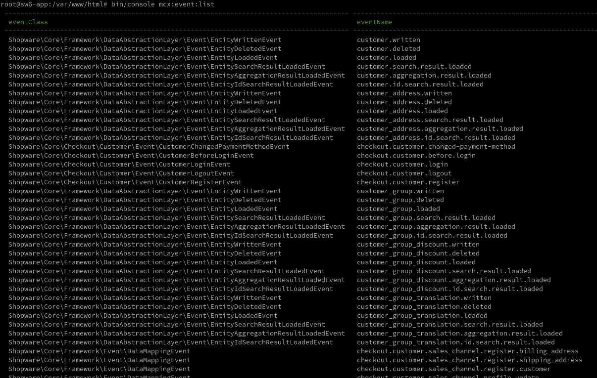
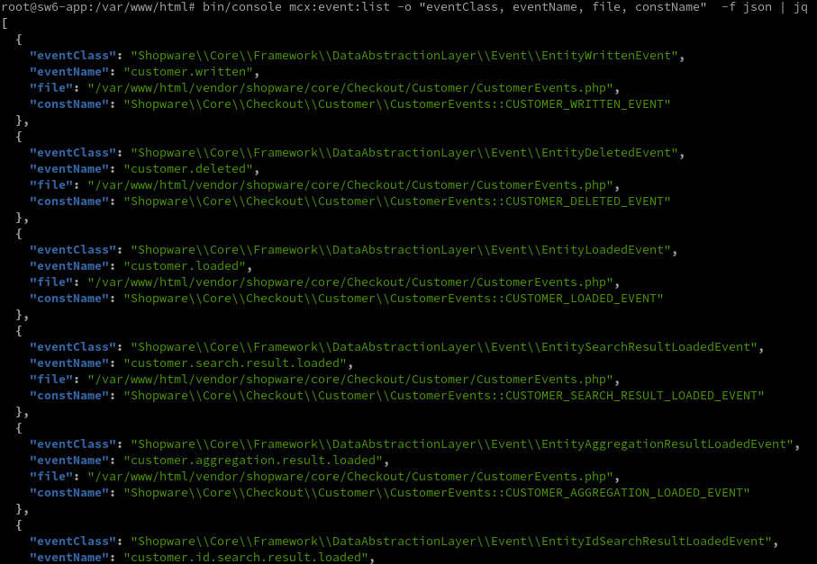

# Mcx Event List

Adds a new console command `mcx:event:list`

The command scans all php files for constants with `@Event` annotations.
It then outputs all found events as a text-table or a JSON list.

### screenshots

*default output*

*json output with manual selection of output fields*

### TODO
- filtering of events
- sorting of events
- grouping of events